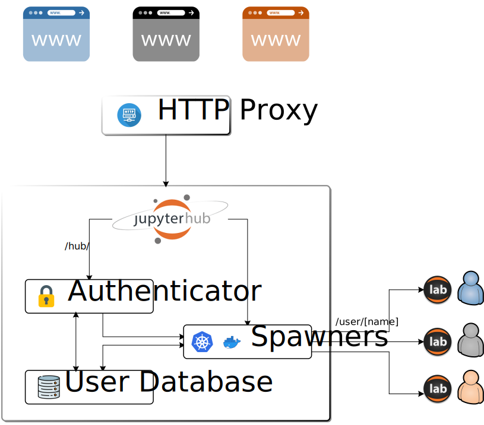

# Docker installation of multi-user version of JupyterHub

[JupyterLab](https://jupyterlab.readthedocs.io/en/stable/), formerly know as JupyterNotebook, is the ecosystem usually deployed and used to run scientific workflows on personal computers. They are mainly used under Python ecosystems, but it increasingly supports more platforms, which are deployed as kernels.

Whereas JupyterLab is meant to run on a personal computer, [JupyterHub](https://jupyterhub.readthedocs.io/en/stable/) is the solution that brings Jupyter notebooks to your own cloud. The official JupyterHub documentation targets large clouds with multiple nodes, managed through Kubernetes. They also include a “The littlest JupyterHub” installation methodology which enables single server deployments for small teams. However they don't consider virtualization or containerization technologies that nowadays help on tidying up and replicating deployments.

In this sense, this tutorial presents a complete solution to deploy JupyterHub server with delegated authentication and containerized environments, based on Docker.

## TL;DR;

If you don't want to go through the whole document, which was initially was going to be short (I promise), and you just want to quickly test it, please follow this short guide.

If you have any issue, do not hesitate to contact us or read the whole document ;)

### Install and configure

Clone the repository
```bash
git clone https://github.com/tlmat-unican/jupyterhub-virtuallab.git
```

Set the value of the environment variables. Take the _`.env.example`_ file as the initial step. This file includes some guidelines on how to to properly fill the values. One of the most important parameters to configure are those related to the authentication methodology you want to use. Therefore, we really encourage you to have a quick look to the [Authentication section](#authentication).

```bash
# cp .env.example .env
# vi .env
```

Create a blank ACME certificates file
```bash
# cd reverse-proxy && touch acme.json && chmod 600 acme.json
```

Create the list of valid users (at least an empty file is required if not restrictions are applied)
```bash
# touch jupyterhub/userlist
# vi jupyterhub/userlist
```

### Execute

Run the containers
```
# docker compose -f docker-compose.traefik.yml up --build 
```
[For my tests]: # (docker container prune -f; docker volume prune -f ; docker-compose up --build)

Your JupyterHub setup will be accessible depending on the authentication methodology configured.

You can restart the services individually. Restarting `singleuser` service will result in just a new single-user Docker image.

```
# docker compose restart jupyterhub
# docker compose restart reverse-proxy
# docker compose restart singleuser
```

Enjoy!

## Objective

Current deployments of teaching laboratories for courses in which practices involve the use of the command-line interface or specific network configurations are carried out by means of full workstation virtualization.  The student executes the laboratory ecosystem with specific virtual machines set up with the tools and configuration files required. Although this methodology is well established, students can only work during the laboratory session. They can continue the work after the sessions, but they have to reconfigure their computers and install the virtual machines and adapt the configuration to their home network. 

In this sense, we consider to move forward and create fully virtualize laboratory, the students can access through any computer just using a web browser. We could have opted to create our own cloud ecosystem, but the required computing and management resources would be quite high, something we cannot afford.

The deal breaker option is to extend the features offered by a default installation JupyterLab. Modifying the JupyterLab base execution environment by including other kernels and creating specific configurations makes it possible to customize the laboratory setup. 

This way we will be able not only to enable seamless access to the laboratory, but to also provide an environment where the students can create live reports the teachers can easily evaluate.

The set-up described in this tutorial has been deployed at [Universidad de Cantabria](https://www.unican.es) for some specific courses in Telecommunications Engineering [Degree](https://web.unican.es/centros/etsiit/Paginas/GITT.aspx) and [Master Degree](https://web.unican.es/centros/etsiit/estudios-de-master/master-universitario-en-ingenieria-de-telecomunicacion). 

You can find the full configuration scripts from our [GitHub repository](https://github.com/tlmat-unican/jupyterhub-docker/). We will be glad to receive your comments, suggestions, bug reports and help requests via the GitHub Issues section. And more important to share your experience if you deploy our solution, or if you have deployed or are planning to deploy something similar.

## Architecture

[//]: # (https://jupyterhub.readthedocs.io/en/latest/reference/technical-overview.html)

A JupyterHub deployment has several components:
- A configurable Proxy, which will be the door to the outside world, and therefore is responsible for securely (TLS) receiving all web requests and dispatching them to the appropriate component.
- A Hub, which is responsible for managing user accounts, handling authentication, spawning single-user Jupyter Notebook servers, and configuring the Proxy.
- Single-user Jupyter servers, which are just Jupyter Notebook servers you are used to run on your personal computer, but now are started and stopped on demand by the Hub as users come and go.

 

From the above, we have to handle three entities, which are directly mapped to three containers (images). To simplify the management, and automatizing the deployment, we will use [Docker Compose](https://docs.docker.com/compose/). The basic system configuration, which will be deeply described, can be summarized with the following tree structure:

```
./
+-- .env
+-- docker-compose.yml
+-- jupyterhub/
|   +-- Dockerfile
|   +-- jupyterhub_config.py
|   +-- userlist
+-- singleuser/
|   +-- Dockerfile
+-- reverse-proxy/
    +-- acme.json 
```

The main configuration file is _`docker-compose.yml`_ in which it is defined the services and their associate configuration parameters, the data volumes required to store and run the services information and the networks to interconnect them. Each service configuration is mapped to its own folder.

```yaml
version: '3'

services:
  # Configuration for Hub+Proxy
  jupyterhub:
    ...
  # Configuration for reverse proxy
  reverse-proxy:
    ...
  # Configuration for single-user servers
  singleuser:
    ...
volumes:
  ...

networks:
  ...
```

## JupyterHub

JupyterHub ecosystem is the center piece of the setup as it coordinates the execution of all the required modules to create and authenticate users and to deploy their own JupyterLab environment. The proxy is just the entity that helps exposing the JupyterHub to the Internet hiding the underlying complexity (communication ports, etc.).

### <a id="singleuserdockerimage"></a>Single user JupyterLab docker image

Before delving in the JupyterHub configuration, we want to focus on the single-user Jupyter server JupyterHub is going to manage. The most simple way to create the docker image of the environment the user will work in is to use one of the already available [Jupyter Docker stacks](https://jupyter-docker-stacks.readthedocs.io/en/latest/), which you can directly reference from [Docker Hub](https://hub.docker.com/).

In our case we have [selected](https://jupyter-docker-stacks.readthedocs.io/en/latest/using/selecting.html) the `jupyter/minimal-notebook` docker image as it includes some useful tools when working within Jupyter applications as, for instance, Latex or git support.

It is important to mention that the docker image version [MUST](https://github.com/jupyter/docker-stacks/blob/main/docs/using/recipes.md#containers-with-a-specific-version-of-jupyterhub) match the one of the JupyterHub.

#### Dockerfile

However, in our case, we have decided to extend that base image to include other tools for network management, etc. But the main difference is the addition of [another kernel](https://github.com/jupyter/jupyter/wiki/Jupyter-kernels) besides the default one supporting Python. We want our notebooks to be able to directly interact with a Linux console avoid the usage of Python magic commands. [bash_kernel](https://github.com/takluyver/bash_kernel) from Thomas Kluyver is used. 

The resulting Dockerfile is shown next:

```dockerfile
ARG JUPYTERHUB_VERSION=3.0.0
FROM jupyter/minimal-notebook:hub-$JUPYTERHUB_VERSION

USER root

RUN apt-get update --yes && \
    apt-get install --yes --no-install-recommends \
    net-tools iputils-ping \
    && apt-get clean && rm -rf /var/lib/apt/lists/*

# Switch back to jovyan to avoid accidental container runs as root
USER ${NB_UID}

ARG JUPYTERHUB_VERSION=3.0.0
RUN pip install --quiet --no-cache-dir jupyterhub==${JUPYTERHUB_VERSION} && \
    fix-permissions "${CONDA_DIR}" && \
    fix-permissions "/home/${NB_USER}"

# A Jupyter kernel for bash
RUN pip install bash_kernel
RUN python -m bash_kernel.install
```

Let's go through it.

In [Docker Hub](https://hub.docker.com/) there are plenty of images (tags) associated to Jupyter notebooks, and some of them are linked to what it seems to be JupyterHub. Although we haven't found any information related to the real meaning of the tags, we have chosen the `hub` tag as it looks appropriate. 

The `JUPYTERHUB_VERSION` environment variable easies the step of matching the JupyterHub version throughout the whole setup.

Then we installed the new Linux packages we want to be included in the image. As the base image is usually set up for `jovyan` user, we have to change to `root` user so the packages installation process runs without any permissions problems. It is important to switch back to `jovyan` user after that, so the Python environment modifications are applied for the correct user. 

JupyterHub Python package matching the JupyterHub version used is installed. We think it is not mandatory as the Dockerfile base image seems to include the necessary scripts (i.e. `start-singleuser.sh`, etc.). But to be on the safe side we prefer to do it, although it is probably already installed.

The last step is the installation of the new kernel, following the instructions pointed out in the [Bash Kernel repository](https://github.com/takluyver/bash_kernel).


#### Docker compose integration

In order to also keep the image building process under the Docker Compose, we have included a `singleuser` service referencing the local Dockerfile.

```yaml
  singleuser:
    build: 
      context: singleuser # Build the container from this folder.
      args:
        JUPYTERHUB_VERSION: ${JUPYTERHUB_VERSION}
    image: tlmat-unican/singleuser
    container_name: singleuser-tlmat
    # When Docker Compose starts the service, it terminates immediately. Indeed this image is meant to be loaded by the Hub, not by Compose.
    command: "echo"
    environment:
      JUPYTER_ENABLE_LAB: 'yes'
    networks: # I think it's not mandatory to put it there.
      - no-internet
```

However, it is important to note that we don't want this service to be running forever. Therefore, we have set the `command` to be executed to `echo`, so the service is immediately ended.

Restarting `singleuser` service will result in just a new single-user Docker image.

```bash
# docker compose restart singleuser
```

### JupyterHub docker image

Although JupyterHub developers and maintainers highly recommend following the [Zero to JupyterHub tutorial](https://zero-to-jupyterhub.readthedocs.io/en/latest/) for installing JupyterHub, we will be using a more straightforward deployment using Docker.

The [Getting Started](https://jupyterhub.readthedocs.io/en/latest/getting-started/index.html) section of the documentation explains the common steps in setting up JupyterHub. Besides, the [JupyterHub tutorial](https://github.com/jupyterhub/jupyterhub-tutorial) provides an in-depth video and sample configurations of JupyterHub.

To build our own Hub, we take the [official JupyterHub container](https://hub.docker.com/r/jupyterhub/jupyterhub/) and apply our configuration on top of it. The resulting Dockerfile is shown next:

```dockerfile
ARG BASE_IMAGE=jupyterhub/jupyterhub
FROM ${BASE_IMAGE}

RUN pip install --no-cache-dir --upgrade jupyter jupyterlab 
RUN pip install --no-cache-dir --upgrade ipython
RUN pip install --no-cache-dir --upgrade dockerspawner
RUN pip install --no-cache-dir jupyterhub-idle-culler
# RUN pip install --no-cache-dir --upgrade  oauthenticator
RUN pip install --no-cache-dir --upgrade  jupyterhub-nativeauthenticator
RUN pip install --no-cache-dir --upgrade jupyterhub-ldapauthenticator
RUN pip install --no-cache-dir --upgrade jupyterhub-ltiauthenticator

# COPY jupyterhub_config.py .
# COPY userlist .

EXPOSE 8000

# It seems it is the command to get the verbose output
# https://github.com/jupyterhub/jupyterhub/issues/3671
# CMD jupyterhub -f /srv/jupyterhub/jupyterhub_config.py --debug
```

In a similar way to the above, we must guarantee that the JupyterHub version is consistent with the one used troughout the setup. Therefore adapt the `BASE_IMAGE` environment variable accordingly. It is recomendend to bind it's value to the `JUPYTERHUB_VERSION` variable.

Next, the upgrade and installation of some Python packages is done. First, the ones linked Jupyter (`juypter` and `jupyterlab`) and Python (`ipython`). After that, we update the `dockerspawner` package which in charge of deploying the single user images. 

Then, [`jupyterhub-idle-culler`](https://github.com/jupyterhub/jupyterhub-idle-culler) is added. It provides a JupyterHub service that automatically stop idle single-user servers. 

And finally, the [authenticator](https://github.com/jupyterhub/jupyterhub/wiki/Authenticators) packages related to different user's credential validation and authorization mechanisms are installed. JupyterHub natively provides a [dummy](https://jupyterhub.readthedocs.io/en/stable/reference/authenticators.html#the-dummy-authenticator) and [PAM](https://jupyterhub.readthedocs.io/en/stable/reference/authenticators.html#the-default-pam-authenticator) authenticators.

The additional ones included are [Native](https://native-authenticator.readthedocs.io/en/stable/), [LDAP](https://github.com/jupyterhub/ldapauthenticator) and [LTI](https://github.com/jupyterhub/ltiauthenticator) authenticators.

Configuration details will be provided next as current section is only focused on the docker image creation.

The very last thing is exposing the port JupyterHub server will be listening to.

JupyterHub configuration (network information, docker spawning, authenticator, etc.) is provided using the Python file `jupyterhub_config.py`. This file can be directly included in the docker image or make it accessible through docker volumes.

In order to generate a default config file with settings and descriptions, on of the following commands can be run, depending wether you have the project files or you just want to learn from scratch:

```bash
# docker run -it --rm jupyterhub/jupyterhub jupyterhub --generate-config -f /dev/stdout
# docker-compose run --rm jupyterhub jupyterhub --generate-config -f /dev/stdout
```

### JupyterHub configuration

Next to Dockerfile, we have `jupyterhub_config.py` to configure the Hub. This plain Python file contains many different sections: general, spawner, services and authentication.

In the general section we include the logging configuration for each of the other subsections, from generic messages to the spawning process. When testing and deploying JupyterHub for the first time it is advisable to enable it.

We have included the `logging` package in order to enable adding extra personalized messages. To do so use the instruction `logging.debug(message)`, `logging.info(message)`, etc. depending on the desired log level.

#### Spawning
We continue with the configuration of the spawner. The class `DockerSpawner` is the one that spawns single-user servers in separate Docker containers. Various environment variables provides the required information:
- `DOCKER_SINGLEUSER_IMAGE`:  name of the [single-user docker image](#singleuserdockerimage). 
- `DOCKER_NETWORK_NAME`: network the server is communicating in. Be aware that networks get an automatic name in Docker, so you must fix it.

> _IMPORTANT! Dockercompose network names are created by concatenating the project name (usually taken from the folder name), the underscore character `_` and the network name setup in the `network` section of the docker compose file (`default` and `no-internet` in our case). In order to have control over the project name, the environment variable `COMPOSE_PROJECT_NAME` must be passed to Docker Compose. You can do this either via the shell, or by using the _`.env`_ file next to _`docker-compose.yml`_, with the following content._

- `DOCKER_NOTEBOOK_DIR`: default folder within the user docker image. Recommended to leave the default value `/home/jovyan`.

We have also defined new volumes where the user data is going to be stored. This is done setting the variable `c.DockerSpawner.volumes`:

```python
# Mount the real user's Docker volume on the host to the notebook user's
# notebook directory in the container
# Stored in /var/lib/docker/volumes/jupyterhub-shared or jupyterhub-user-{username}
c.DockerSpawner.volumes = { 
    'jupyterhub-user-{username}': notebook_dir, 
    'jupyterhub-shared': {"bind": '/home/jovyan/shared', "mode": "r"}
}
```

The first one `jupyterhub-user-{username}` is bound to the home folder for each user, while the `jupyterhub-shared` is shared by all the users who will find a `shared` folder in their home. This folder is set as read-only and is intended to store general information like templates, documentation, etc. Defining a folder as read-only can also be accomplished through `c.DockerSpawner.read_only_volumes`, but this way is more generic and centralized. To change the access permissions just modify the `mode` key to `r`, `rw` and so on. 

These volumes are mapped under the default docker volumes folder `/var/lib/docker/volumes`. In case you want to store in another location, it is required to set the volume name as full or absolute path (i.e. `/root/project/jupyterhub-shared`). 

As an optional feature, we may want to stop the stop the single-user servers after a certain amount of idle time. For that purpose we register the JuupyterHub Idle Culler service following its installation instructions, that is, enabling it as a [Hub manage service](https://github.com/jupyterhub/jupyterhub-idle-culler#as-a-hub-managed-service) and assigning the required [permissions](https://github.com/jupyterhub/jupyterhub-idle-culler#permissions).

#### Networking

The networking section states the IP address, port and bind URL the Hub is waiting at. We also have to set the IP address the user docker containers will use to access the Hub. This address is referred to the one associated to the Hub service within the docker network, and it is set using the environment variable `HUB_IP`.

#### <a id="authentication"></a>Authentication

The final step in JupyterHub's configuration is the authentication method. By default, JupyterHub authenticates users with the local system, that is, via PAM. For PAM to work, we can choose to create the users within the docker image, that is, modifying the Dockerfile to include as many `useradd` commands as required and the set the password individually for each user; or we can [mount external](https://github.com/jupyterhub/jupyterhub/issues/535) `/etc/passwd`, `/etc/group` and `/etc/shadow` files to replicate the host configuration.

Using PAM is not useful for medium scale deployments, even for small scale ones, considering the [other options JupyterHub offers](https://github.com/jupyterhub/jupyterhub/wiki/Authenticators). We have decided to provide a JupyterHub configuration that includes the most useful authenticator for our purpose. These ones are Native Authenticator or delegated methodologies as LDAP Authenticator and LTI Authenticator. Another quite common option is to use [OAuth Authenticator](https://github.com/jupyterhub/oauthenticator).

The authenticator is selected using the `AUTH_MODE` environment variable, which values includes `native`, `ldap` and `lti`. In the future we will include other authenticators in order to have an even more flexible environment.

Before delving in the details for each authenticator, it is important to note that in order to avoid security issues we have blocked `root` user. This way nobody won't login or be able to run commands as superuser (except if `sudo` mode is enabled).

```python
c.Authenticator.blocked_users = {'root'}
```

##### Native Authenticator

This is a relatively simple authenticator that provides sign-up and authentication capabilities without relying on external services. User's credentials are keep internally as native to JupyterHub with the advantage over PAM Authenticator of not have to create real users.

```python
    import nativeauthenticator
    c.JupyterHub.authenticator_class = 'nativeauthenticator.NativeAuthenticator'
    c.JupyterHub.template_paths = [f"{os.path.dirname(nativeauthenticator.__file__)}/templates/"]

    # Make sure nobody can create an account with the name root or login as root
    # c.Authenticator.blocked_users = {'root'}
    # c.Authenticator.allowed_users = whitelist
    # c.Authenticator.admin_users = admin

    # Password Strength
    c.NativeAuthenticator.check_common_password = False
    c.NativeAuthenticator.minimum_password_length = 10
    # Block users after failed logins
    c.NativeAuthenticator.allowed_failed_logins = 3
    c.NativeAuthenticator.seconds_before_next_try = 600
    # Disable SignUp
    # !IMPORTANT: If no account was created, it is impossible to register new accounts
    # c.NativeAuthenticator.enable_signup = False

    # ! IMPORTANT: 
    # Request additional user information
    # TODO: still to be checked to include mail address
    c.NativeAuthenticator.ask_email_on_signup = True

    # Add two factor authentication obligatory for users
    c.NativeAuthenticator.allow_2fa = True
```

This authenticator provides a set of management web pages and resources that users and administrators can use to manage the access to Jupyter notebooks.

Every user must register at `/hub/signup` with a username and password. Then administrators will grant access using the `/hub/authorize`. It is important to note that administrator accounts also be created through signup. In order to set these accounts role as admin they have to be explicitly included in the configuration file:

```python
c.Authenticator.admin_users = admin = { 'admin', 'mngr'}
```

In case you want you users to be automatically authorized after signing in or reject their sign in and login request, you can include them in the `allowed_users` or `blocked_users` list respectively during the configuration phase. If at any time you want to disable the registration of more users, just disable `enable_signup`.

Users that are logged in the system can easily change their password at `/hub/change-password` or by clicking the “Change Password” element on their home page. Besides administrators can also reset the password for those who forget it by accessing `/hub/change-password/{username}` or the “Change Password” in the authorization area of the user.

In addition, it is important to set the characteristics of the passwords used. They can be limited in length (`minimum_password_length`) or their value can be verified not to be included in a [common password list](https://github.com/danielmiessler/SecLists/blob/master/Passwords/Common-Credentials/10-million-password-list-top-10000.txt) (one defined by authenticator's developers).

In order to add a bit more security to your system, you can also set the number of failed logins before a user is blocked (`allowed_failed_logins`), or limit the time between login retries (`seconds_before_next_try`).

Moreover, you can increase security on additional level making two factor authentication (2FA) mandatory for all users (`allow_2fa`). After signup, the user will receive a message with the 2FA code. They have to safely keep this code, as it is the secret to be included in the 2FA application providing the One-Time-Password (OTP). Some examples of open source 2FA applications for Android are [Authenticator Pro](https://github.com/jamie-mh/AuthenticatorPro) or [Aegis Authenticator](https://github.com/beemdevelopment/Aegis), but proprietary apps from Microsoft or Google are alo valid.

More detailed information can always be found at the [Native Authenticator ReadTheDocs site](https://native-authenticator.readthedocs.io/)

##### LDAP Authenticator

It is quite common that companies or educational entities have a directory storing the credentials for their community. In this sense, Lightweight Directory Access Protocol (LDAP) is the usual solution, while if their ecosystem is based in Microsoft products, Active Directory is used. Both solutions share similar approaches.

[LDAP Authenticator](https://github.com/jupyterhub/ldapauthenticator) is a simple LDAP plugin for JupyterHub which support [delegated user authentication based on an LDAP environment](https://connect2id.com/products/ldapauth/auth-explained).

```python
    c.JupyterHub.authenticator_class = 'ldapauthenticator.LDAPAuthenticator'
    # c.LDAPAuthenticator.log_level = 'DEBUG'
    c.LDAPAuthenticator.server_address = os.environ['LDAP_server_address']
    c.LDAPAuthenticator.use_ssl = True
    c.LDAPAuthenticator.server_port = int(os.environ['LDAP_server_port'])
```

At minimum, the LDAP authenticator has to include the networking information (`server_address`, `server_port` and `use_ssl`) and the corresponding DN to bind against the LDAP server.

[Bind operations](https://ldap.com/the-ldap-bind-operation/) are used to authenticate clients (and the users or applications behind them) to the directory server, to establish an authorization identity that will be used for subsequent operations processed on that connection, and to specify the LDAP protocol version that the client will use.

Authentication consists of at least two parts: identifying who or what is authenticating, and supplying some kind of proof of that identity (usually something only that user should know or have, like a static and/or password, a certificate, a hardware or software token, and/or biometric information). In simple authentication, the account to authenticate is identified by the distinguished name (DN) of the entry for that account, and the proof identity comes in the form of a password. The password is transmitted without any form of obfuscation, so it is strongly recommended that simple authentication be used only over an encrypted connection (e.g., one that has been secured by SSL/TLS, or with the StartTLS extended operation).

Therefor, a connection is opened to the directory server, then a request is sent to authenticate the connection as a particular user by passing its entry DN and password.

When you know the DN of the users, you don't have to perform a reverse lookup. This is the more simple case where users employ their LDAP registered username as the login username. In that case, the configuration below is enough:

[//]: # (In our case we will be using the short identifier assigned by our university)

```python
    c.LDAPAuthenticator.lookup_dn = False
    c.LDAPAuthenticator.bind_dn_template = os.environ['LDAP_bind_dn_template'].split(';')
    c.LDAPAuthenticator.valid_username_regex = '^[a-zA-Z][.a-zA-Z0-9_-]*$'
    c.LDAPAuthenticator.escape_userdn = False
```

The `bind_dn_template` is required to be non-empty list of templates the users belongs to. In our case, we have defined the value to be included from `LDAP_bind_dn_template`. In order to support multiple entries (list) we have decided to separate each list element by the character `;`. The conversion is exemplified below:


_`.env`_
```bash
LDAP_bind_dn_template=CN={username},CN=Users,DC=domain,DC=com;CN={username},OU=Users,DC=anotherdomain,DC=com
```

_`jupyterhub_config.py`_
```python
c.LDAPAuthenticator.bind_dn_template = [
  "CN={username},CN=Users,DC=domain,DC=com",
  "CN={username},OU=Users,DC=anotherdomain,DC=com"
]
```

As most LDAP systems uses the attributes naming, this simple configuration would be enough to perform a basic delegated authentication.

In case you cannot generate the DN directly or you are using some LDAP servers, such as Active Directory, that don't always bind with the true DN, you have to configure the system to do a reverse lookup to obtain the user's DN. This could be the example when you enable login using an email address. Then, you have to first run a search against the email attributes to find the matching DN, and then perform the actual bind operation using the real DN and the password.

To configure JupyterHub LDAP authenticator to run a DN resolution, `lookup_dn` must be set to True. Besides that, if anonymous LDAP query is not supported, both `lookup_dn_search_user` and `lookup_dn_search_password` has to set.

The directory attributes to search for are defined in the `lookup_dn_search_filter` configuration parameter. The `{login}` placeholder is substituted with the user identifier entered in the login form.

```python
    # Search by sAMAccountName
    # c.LDAPAuthenticator.lookup_dn_search_filter = '(&(objectclass=user)(sAMAccountName={login}))'
    # Search by default login_attr ('username')
    # c.LDAPAuthenticator.lookup_dn_search_filter = '({login_attr}={login})'
    # Search by uid or mail
    # c.LDAPAuthenticator.lookup_dn_search_filter = '(&(objectclass=user)(|(uid=%u)(mail=%u)))'
```

It is important to note that the attributes with which users login must be unique and that every user has these attributes defined.

<!---
TEST USING EMAIL ACCOUNT or short nameAS LOGIN ATTRIBUTE WITH LDAP FOR OUR INTERNAL USE CASE
# c.LDAPAuthenticator.user_search_base = 'CN=Users,DC=alumnos,DC=unican,DC=es'
# c.LDAPAuthenticator.lookup_dn_search_filter = '(&(objectclass=user)(|(userPrincipalName={login})(mail={login})(sAMAccountName={login})))' 
)
--->

An example configuration involving Active Directory integration is shown below.

```python
    c.LDAPAuthenticator.lookup_dn = True
    c.LDAPAuthenticator.lookup_dn_search_filter = '({login_attr}={login})'
    # Technical account for user lookup
    c.LDAPAuthenticator.lookup_dn_search_user = os.environ['LDAP_lookup_dn_search_user']
    c.LDAPAuthenticator.lookup_dn_search_password = os.environ['LDAP_lookup_dn_search_password']
    # Example "CN=Users,DC=domain,DC=com"
    c.LDAPAuthenticator.user_search_base = os.environ['LDAP_user_search_base']
    c.LDAPAuthenticator.user_attribute = 'sAMAccountName'
    c.LDAPAuthenticator.lookup_dn_user_dn_attribute = 'cn'
    c.LDAPAuthenticator.escape_userdn = False
    # The {username} is expanded to the full path to the LDAP object returned by the LDAP lookup.
    c.LDAPAuthenticator.bind_dn_template = '{username}'
```

More detailed information can always be found at the [Native Authenticator wiki site](https://github.com/jupyterhub/ldapauthenticator#readme)

##### LTI Authenticator

When using JupyterHub for online courses, it may be advisable to integrate it with e-learning platforms like Canvas, Open EdX, Moodle, Blackboard, etc. Users have to authenticate in order to access their courses. Therefore it is sensible to delegate JupyterHub authentication on these platforms.

Learning Tools Interoperability (LTI) version [1.1](https://www.imsglobal.org/specs/ltiv1p1p1/implementation-guide) and [1.3](https://www.imsglobal.org/spec/lti/v1p3/impl) specifications allow remote tools and content to be integrated into a Learning Management System (LMS).

[JupyterHub LTI Authenticator](https://github.com/jupyterhub/ltiauthenticator) offers integration with LMS systems. The authentication is not run from JupyterHub login page, but directly from the LMS ecosystem. In this sense, trusted LTI 1.1 compliant Tool Consumer or LTI 1.3 compliant Platform will forward the login information to the hub.

Initially, we have chosen to use LTI 1.1 version which uses a client id and secret to authenticate the LMS to the hub. Those values must be as random as possible and be kept secure. And option to easily generate them is using `openssl`:

```bash
$ openssl rand -hex 32
```

The obtained values will be assigned to the client/consumer key and the client/shared secret. As the same JupyterHub can be access from multiple sources the `consumers` variable is defined as a dictionary where the key is the client key and the value is the secret.

As previously done, and in order to keep sensitive values out of the main configuration file, we have use `LTI_CLIENT_KEY` and `LTI_SHARED_SECRET` environment variables. Actually, our configuration is only managing one LMS source server.

In order to start executing Jupyter notebook assigned to the user, the LMS sends a POST request to JupyterHub. The body includes a JSON file with multiple keys. Any of them, but specially the one linked to the user, can be used as JupyterHub username. A [partial list of keys](https://www.edu-apps.org/code.html#params) in an LTI request is available as a reference.

An example from our Moodle server is shown below:

```json
"params": [
  {
    "name": "oauth_version",
    "value": "1.0"
  },
  {
    "name": "oauth_nonce",
    "value": "11693c6644153450920784a1068e3afb"
  },
  {
    "name": "oauth_timestamp",
    "value": "1667495272"
  },
  {
    "name": "oauth_consumer_key",
    "value": "fc574f610c80c72283244739ce244794cc6b37fba652a3011898f84cfbf6b666"
  },
  {
    "name": "user_id",
    "value": "22687"
  },
  {
    "name": "lis_person_sourcedid",
    "value": "teacher"
  },
  {
    "name": "roles",
    "value": "Instructor"
  },
  {
    "name": "context_id",
    "value": "7759"
  },
  {
    "name": "context_label",
    "value": "CPJH"
  },
  {
    "name": "context_title",
    "value": "Curso+de+Prueba+para+JupyterHub"
  },
  {
    "name": "resource_link_title",
    "value": "JupyterHub"
  },
  {
    "name": "resource_link_description",
    "value": ""
  },
  {
    "name": "resource_link_id",
    "value": "611"
  },
  {
    "name": "context_type",
    "value": "CourseSection"
  },
  {
    "name": "lis_course_section_sourcedid",
    "value": "CPJH"
  },
  {
    "name": "lis_result_sourcedid",
    "value": "%7B%22data%22%3A%7B%22instanceid%22%3A%22611%22%2C%22userid%22%3A%2222649%22%2C%22typeid%22%3Anull%2C%22launchid%22%3A225217575%7D%2C%22hash%22%3A%22a7d5e1fc9395207378a4afaeaeda7760a23fd596b8164e2aec11b00f893143b0%22%7D"
  },
  {
    "name": "lis_outcome_service_url",
    "value": "https%3A%2F%2Fmoodle.your-domain.com%2Fmod%2Flti%2Fservice.php"
  },
  {
    "name": "lis_person_name_given",
    "value": "John"
  },
  {
    "name": "lis_person_name_family",
    "value": "Doe"
  },
  {
    "name": "lis_person_name_full",
    "value": "Doe%2C+John"
  },
  {
    "name": "ext_user_username",
    "value": "teacher"
  },
  {
    "name": "lis_person_contact_email_primary",
    "value": "teacher%40your-domain.com"
  },
  {
    "name": "launch_presentation_locale",
    "value": "es"
  },
  {
    "name": "ext_lms",
    "value": "moodle-2"
  },
  {
    "name": "tool_consumer_info_product_family_code",
    "value": "moodle"
  },
  {
    "name": "tool_consumer_info_version",
    "value": "2020061516"
  },
  {
    "name": "oauth_callback",
    "value": "about%3Ablank"
  },
  {
    "name": "lti_version",
    "value": "LTI-1p0"
  },
  {
    "name": "lti_message_type",
    "value": "basic-lti-launch-request"
  },
  {
    "name": "tool_consumer_instance_guid",
    "value": "moodle.your-domain.com"
  },
  {
    "name": "tool_consumer_instance_name",
    "value": "MoodleTest"
  },
  {
    "name": "tool_consumer_instance_description",
    "value": "Moodle+de+Test"
  },
  {
    "name": "launch_presentation_document_target",
    "value": "window"
  },
  {
    "name": "launch_presentation_return_url",
    "value": "https%3A%2F%2Fmoodle.your-domain.com%2Fmod%2Flti%2Freturn.php%3Fcourse%3D7759%26launch_container%3D4%26instanceid%3D611%26sesskey%3DDR3c2EFZgQ"
  },
  {
    "name": "oauth_signature_method",
    "value": "HMAC-SHA1"
  },
  {
    "name": "oauth_signature",
    "value": "2xvLVVqCq7MpfUCLlmr4Aiyk5jk%3D"
  }
]
```

And from all of them, the ones that can be used as `username_key` are:

- `user_id`
- `lis_person_sourcedid`
- `lis_person_name_given`
- `lis_person_name_family`
- `lis_person_name_full`
- `ext_user_username`
- `lis_person_contact_email_primary`

Again, we set the value through the environment variable `LTI_USERNAME_KEY`.

As opposed to the rest of the described authenticators, in this case it is not the user who access a specific login page, but the LMS using the logged username. Then we have to configure the LMS to launch that request.

In the case of Moodle, we have to include an [External Tool Activity Module](https://docs.moodle.org/400/en/External_tool_settings) in our course. Then we have to configure it. 

Most of the values (`Activity Name`, `Tool Name`, `Consumer key`, `Shared key`, etc.) are quite straightforward to fill. It is important to note that the `Tool URL` must point to the `/hub/lti/lauch` resource in the JupyterHub server, that is for instance `https://my-domain.com/hub/lti/lauch`.

Other LMS configuration examples and additional LTI Authenticator information can be found at [LTI Authenticator wiki site](https://github.com/jupyterhub/ltiauthenticator). Although LTI v1.3 is supposed to be supported, there is no configuration tutorial for Moodle. We have to further invetigate on the use of LTI v1.3 as it provides SSL or public/private key authentication between LMS and JupyterHub in stead.

<!-- 
LTI1.3 es con RSA y certificados. Habrá que mirar como va.

https://github.com/jupyterhub/ltiauthenticator#readme

Under constrution
https://ltiauthenticator.readthedocs.io/en/latest/ 
-->

#### Filtering users

The depicted autheticators access and validate user credentials in different ways. Users with valid credentials are accepted by default. However we can restrict access and assigned different roles to users.

New JupyterHub versions from 2.0 on, implement Role Based Access Control (RBAC). It serves to provide fine grained control of access to Jupyterhub’s API resources. By default, four roles are defined: `user`, `admin`, `token` and `server`. But new ones, associated with scopes (specific permissions to access API), can be defined. More information can be found in the [RBAC specific ReadTheDocs site](https://jupyterhub.readthedocs.io/en/stable/rbac/index.html).

However for our objective we only need to restrict user access and define which of the allowed users are administrators. To achieve that, we only have to set the corresponding `allowed_users` and `admin_users` lists.

```python
c.Authenticator.blocked_users = {'root'}
c.Authenticator.allowed_users = whitelist
c.Authenticator.admin_users = admin
```

`allowed_users` includes the list of users than can access JupyterHub and run its own JupyterLab instance. `admin_users` stores the list of users with admin rights. We also use the variable `blocked_users` to set the list of users who cannot access access to the system. `allowed_users` and `blocked_users` variables are opposite.

We have block `root` user. As we have already explained, this will avoid security issues related with running commands as superuser (except if `sudo` mode is enabled).

In order to help configuring these lists and not to have to modify the `jupyterhub_config.py` configuration file each time we want to grant access to new users, we have externalized this feature.

If there is a `userlist` file in the `/srv` folder of our JupyterHub image, this file will is read to discover the usernames of admins and normal users. If there is not such a file or the file is empty, no restrictions are set and no admin is defined.

The `userlist` file format requires a username per line. If a user is to set as administrator, the `admin` tag has to be included next to the user. An `userlist` example file is included below:

```
user1 admin
user2 admin
user3
user4 
```

It is recomended that at least this file includes one admin account, as the rest can be included later on (depending on the authenticator used).

## Reverse proxy

A proxy server is an intermediary server that forwards requests for content from multiple clients to different servers across the Internet. 

Typically server applications are not directly exposed to the Internet and sits behind a firewall in a private network. A reverse proxy is a type of  proxy server located at the edge of any network that directs client requests to the appropriate backend server. 

It acts as a gateway between clients and the application origin server. This way, we present a single IP address to the Internet while relaying requests to different internal servers based on the domain name of the requests.

A reverse proxy usually operates by:
  - Receiving a user connection request
  - Completing a TCP three-way handshake, terminating the initial connection
  - Connecting with the provisioning server and forwarding the original request

A reverse proxy provides additional functionalities like load balancing, web acceleration or security and anonymity.

Traditional web servers like [Apache](https://httpd.apache.org/docs/trunk/es/howto/reverse_proxy.html) or [Nginx](https://docs.nginx.com/nginx/admin-guide/web-server/reverse-proxy/) can be configured as reverse proxies, but there are dedicated solutions. Among all the existing solutions, [HAProxy](https://www.haproxy.com/), [Squid](http://www.squid-cache.org/) or [Traefik](https://traefik.io/) stand out.

We will include documentation or examples for Nginx, HAProxy and Traefik, being the latter the one whose configuration we will depict in depth. 

Traefik is an HTTP reverse proxy and load balancer for microservices. It makes it 
easy publising and securing applications or server deployed using containers.

Its configuration is based on a twofold approach: on the one side, it is required to define a startup configuration, also known as static configuration, and on the other, a dynamic routing configuration that defines how requests are handled and it seamlessly hot-reloaded. 

[Muy bueno con grandes ejemplos de configuracion]: # (https://www.benjaminrancourt.ca/a-complete-traefik-configuration/)
[Otra muy buena configuracion. Interesante el redirectScheme]: # (https://mwunderling.com/blog/traefik2.html)

Static configuration can be defined refering to a configuration file (TOML or YAML formats are supported), or using command-line arguments or environment variables. This configuration includes entrypoints (the ports Traefik listens to) and providers (connections to the services you want Traefik to proxy), as well as other infrastructure and security related options.

In our configuration setup, in order to make it more self-contained, we have decided to use the commandline option. It will be quite straight forward to use a [configuration file](https://doc.traefik.io/traefik/reference/static-configuration/file/).


[//]: # (https://doc.traefik.io/traefik/https/acme/)
[//]: # (https://doc.traefik.io/traefik/v2.0/middlewares/overview)
[//]: # (https://doc.traefik.io/traefik/v2.0/middlewares/basicauth)
[//]: # (https://doc.traefik.io/traefik/v2.0/middlewares/redirectscheme)

### API and dashboard

```yaml
  # Configuration for reverse proxy
  reverse-proxy:
    ...
    command:
      # - "--log.level=DEBUG"
      # API and dashboard
      - "--api.dashboard=true"
      - "--api.insecure=false"
    ...
      # Entrypoints
    ...
      - --entrypoints.traefik.address=:8080
    ...
    labels:
      - "traefik.enable=true"
      # Dashboard
      - "traefik.http.routers.dashboard.rule=(PathPrefix(`/api`) || PathPrefix(`/dashboard`))"
      - "traefik.http.routers.dashboard.service=api@internal"
      # - "traefik.http.routers.dashboard.tls=true"
      # - "traefik.http.routers.dashboard.tls.certresolver=le"
      - "traefik.http.routers.dashboard.entrypoints=traefik"
      - "traefik.http.routers.dashboard.middlewares=authdashboard"
      - "traefik.http.middlewares.authdashboard.basicauth.users=${TRAEFIX_DASHBOARD_AUTH}"
    volumes:
      - /var/run/docker.sock:/var/run/docker.sock:ro
      # touch acme.json && chmod 600 acme.json
      - ./reverse-proxy/acme.json:/acme.json
```

The first part defines how the API is accessed and enable access to the dashboard, whose security access level is fixed byt the API one. In this case, for the shake of learning, we have considered that authentication is required, but we haven't set communication to be handled using TLS. Therefore, traffic is sent in clear, but as the access to API and dashboard is restricted to the securted internal network the system is deployed in, we expect there won't be security issues.

Although in the static configuration it is set that security is enabled, it is under the dynamic configuration that the credentials (basic authentication is used) are defined. The `dashboard` [router](https://doc.traefik.io/traefik/routing/routers/) is linked to `traefik`entry point defined in the static configuration which defines the listening port. 

Basic authentication is enabled through a Traefik middleware [`basicauth`](https://doc.traefik.io/traefik/v2.0/middlewares/basicauth). A [Traefik middleware](https://doc.traefik.io/traefik/v2.0/middlewares/overview) modifies the requests before they are sent to the service or before the answers are to the clients. In the case of our `basicauth` middleware configuration, in order not to include the usernames and passwords that has access to the dashboard and API, the `TRAEFIX_DASHBOARD_AUTH` environment variable is used. Multiple users can be defined separeted by a comma. In order to properly generate the password, you can look for online generators or use the following command:

```bash
$ echo $(htpasswd -nB user) | sed -e s/\\$/\\$\\$/g
```

### Entrypoints

```yaml
  # Configuration for reverse proxy
  reverse-proxy:
    ...
    command:
    ...
    # Entrypoints
    - --entrypoints.web.address=:80
    - --entrypoints.websecure.address=:443
    - --entrypoints.traefik.address=:8080
    ...
```

We have already introduced the `traefik` entrypoint. Entrypoints define the ports and type of traffic Traefik will be listening to. Besides the `traefik` one, our setup defines two additional ones, plain and secured HTTP access, accepting network traffic in the default 80 and 443 ports.

```yaml
  # redirection to https
  - --entrypoints.web.http.redirections.entrypoint.to=websecure
  - --entrypoints.web.http.redirections.entrypoint.scheme=https
```

Then, in order to force HTTPS communications with redirect all connections through `web` endpoint to `websecure` with `https` scheme. This configuration applies to all the host Traefik controls within this Docker compose. Nevertheless, it is possible to configure HTTP to HTTPS redirection per service using the [`redirectScheme` middleware](https://doc.traefik.io/traefik/v2.0/middlewares/redirectscheme).

```yaml
  - traefik.enable=true
  - traefik.http.routers.myservice-http.entrypoints=web
  - traefik.http.routers.myservice-http.rule=Host(`myservice.${DOMAINNAME}`)
  - traefik.http.routers.myservice-https.entrypoints=websecure
  - traefik.http.routers.myservice-https.rule=Host(`myservice.${DOMAINNAME}`)
  - traefik.http.routers.myservice-https.tls=true
  - traefik.http.routers.myservice-https.tls.certresolver=default
  - traefik.http.routers.myservice-http.middlewares=myservice-https@docker
  - traefik.http.middlewares.myservice-https.redirectscheme.scheme=https
  - traefik.http.middlewares.myservice-https.redirectScheme.permanent=true
```

In that case we can define a router for the corresponding service linked to the endpoints defined in the static configuration. We can also set the rule for the hosts or paths we want to match for that specific entrypoint. The we apply the `redirectscheme` middleware to the non-secure router `myservice-http`. In the example aboved, we named the middleware `myservice-https@docker` which means `myservice-https`under the `docker` profile namespace. This middleware permantly redirects using the https scheme in the URL.

### TLS certificates

```yaml
  # Configuration for reverse proxy
  reverse-proxy:
    ...
    command:
      ... 
      # Let's encrypt
      - "--certificatesresolvers.le.acme.tlschallenge=true"
      # To use the staging server in stead of production
      #- "--certificatesresolvers.myresolver.acme.caserver=https://acme-staging-v02.api.letsencrypt.org/directory"
      - "--certificatesresolvers.le.acme.email=${LE_CONTACT_EMAIL}"
      - "--certificatesresolvers.le.acme.storage=/acme.json"
    volumes:
      ... 
      # touch acme.json && chmod 600 acme.json
      - ./reverse-proxy/acme.json:/acme.json
    ...
```

The networking configuration concludes by defining the methology to be used for [certificates management and TLS connectivity](https://doc.traefik.io/traefik/https/overview/). Traefik supports the use of [user defined certificates](https://doc.traefik.io/traefik/https/tls/), that can be self-signed or obtained for a valid Certificate Authority. If you want to publicly exposed the proxy and the content behind it, the best and most simple choice is using an [Automatic Certificate Management Environment (ACME) provider](https://doc.traefik.io/traefik/https/acme/) like [Let's Encrypt](https://letsencrypt.org/).

All the configuration to manage the certificates is included under the dynamic configuration section, but in case of using ACME server, Traefik requires you to define certificate resolvers in the static configuration, which are responsible for retrieving certificates from an ACME server. Then, the Traefik routers has enable TLS and a certificate resolver has to be associated.

Traefik supports [three different ACME challenges modes](https://doc.traefik.io/traefik/https/acme/#the-different-acme-challenges): HTTP, DNS and, the newest, TLS. Pussing for a full HTTPS ecosystem we decided to implement the TLS-ALPN-01 challenge (`tlschallenge`).

Besides, it is required to define where the ACME certificates are saved to (`storage`). This file needs to be set with `600` permissions. The easiest way as we are not redifining Traefik docker image is to mount the JSON file or folder from the host. This is done using the Docker Compose `volumes`. However prior to that, the file must exist and be consistent with the required permissions. 

Althought [Git keeps track of file permissions](https://stackoverflow.com/a/4408378/422680) and there are [options to set file permissions](https://stackoverflow.com/questions/3207728/retaining-file-permissions-with-git) by using [git-cache-meta](https://stackoverflow.com/a/3208143/422680), we consider it is easier to create the file in the `reverse-proxy` folder and apply the permissions:

```bash
# cd reverse-proxy
# touch acme.json && chmod 600 acme.json
```

Finally, we use the `LE_CONTACT_EMAIL` environment variable to include the e-mail address to be included in the certificate as contact point.

### Providers

A Traefik provider is a component that can be queried through a well-know API in order to retrieve relevant information about routing. 

In our case, we use the Docker provider which will enable gathering data from the docker services running seamless. Then, we attach labels to the containers and Traefik will make use of that information to automatically manage the traffic to the container or service. Labels are a Docker defined mechanism for applying metadata to Docker objects. 

```yaml
  # Configuration for reverse proxy
    ...
    command:
      ...
      # Providers
      - "--providers.docker=true"
      - "--providers.docker.watch=true"
      - "--providers.docker.endpoint=unix:///var/run/docker.sock"
      - "--providers.docker.exposedbydefault=false"
      ...
    volumes:
      - /var/run/docker.sock:/var/run/docker.sock:ro
      ...
```

After enabling Docker provider, we set Traefik to watch for Docker events. By default all containers are exposed through Traefik. We prefer to have more control over the exposed services, so we set the default behaviour to false. That way, if you want a container to be included in the dynamic routing configuration the container must include the label `traefik.enable=true`.

Traefik requires access to the docker socket to get its dynamic configuration. Therefore, we use the current Docker API of the host. For the sake of security we enable the link to the host file in read-only access mode.


### JupyterHub container dynamic configuration

The final part of the Traefik configuration is the one related to configure the containers or servicies whose comunication with the outside world Traefik will manage.

As we stated previously, we have configured Traefik not to be managing docker containers by default. Therefore, for those services we want to include we have to explicitly say so.

```yaml
  # Configuration for Hub+Proxy
  jupyterhub:
    ...
    labels:                          # Traefik configuration.
      # Tell Traefik to consider (or not) the container (exposedByDefault overriden)
      - "traefik.enable=true"
      # localhost???
      #- "traefik.http.routers.jupypterhub.rule=Host(`192.168.56.110`) || Host(`127.0.0.1`) || Host(`localhost`)"
      # For testing purpouses (uses selfsigned certificate by Traefik)
      - "traefik.http.routers.jupypterhub-test.rule=Host(`${HOST_INTERNAL_NAME}`) || Host(`${HOST_INTERNAL_IP}`) || Host(`${HOST_IP}`)"
      - "traefik.http.routers.jupypterhub-test.tls=true" 
      # For public provisioning (uses Let's Encrypt certificate)
      - "traefik.http.routers.jupypterhub.rule=Host(`${HOST_NAME}`)" 
      - "traefik.http.routers.jupypterhub.tls=true"
      - "traefik.http.routers.jupypterhub.tls.certresolver=le"
    ...
```

In our case, we want Traefik to help us exposing JupyterHub container. Then, we have to enable Traefik for it, and we do so under `labels` entry of the `jupyterhub` service.

The next step is defining the [rules](https://doc.traefik.io/traefik/routing/routers/#rule) to match the hosts, path or headers we want Traefix to redirect to JupyterHub server. In our case, we have set two diferent routers associated with the `jupyterhub` service: one for testing (`jupyterhub-test`) and another one for the production or public environment (`jupyterhub`). 

Current rules match only the hostnames or IP addresses, which are defined using multiple environment variables.

Both of them are handle using HTTPS, although the certificates for the test environment are just Traefix self-signed certificates, which is more than enough for our internal network. The certificates for exposing JupyterHub to the Internet are handled by the `le` ACME certificate resolver we previously defined in the Traefik static configuration (`reverse-proxy` service).


## Data persistance

Using [Docker volumes](https://docs.docker.com/storage/volumes/), we make storage permanent. Current configuration uses volumes to store JupyterHub configuration (`jupyterhub_config.py` and `userlist`) and the user’s data for the single-user servers, which by default are located at `/var/lib/docker/volumes/jupyterhub-shared` and `/var/lib/docker/volumes/jupyterhub-user-{username}`.

However, JupyterHub configuration doesn't offer control of the volume of data the users create, that is, there is no configuration parameter to limit the size of single-user containers' volume.

The solution we found to control the size is to periodically check for kernel core files (whose size we already limit) and for file exceding a limit (currently 10MB). 

That functionality is include the script `jupyterhub-clean-disk-space.sh` which will be run daily.

We will be sending an email to the users exceeding the limits:

> These files weight more than XXX Mb; if you don't need them, you
> may use `rm ...` from a terminal to delete them.

But this is still under development.


## Networking

In the context we are configuring, it is mandatory that users don't have access to any network connectivity beyond the single-user container. The containers deployed for each user are fully fledged Linux servers and can have access to any other computer in the network they are deploy. That might arise plenty of security issues as the container can be considered an inside man. 

Therefore it is mandatory to block any connection from the single-users servers, except the ones required to interact with the Hub. 

```yaml
services:
  # Configuration for Hub+Proxy
  jupyterhub:
    environment:                     # Env variables passed to the Hub process.
      ...
      DOCKER_NETWORK_NAME: ${COMPOSE_PROJECT_NAME}_no-internet
      HUB_IP: jupyterhub-tlmat_no-internet
      ...
    networks:
      default:
      no-internet:
          aliases:
            - jupyterhub-tlmat_no-internet

  # Configuration for reverse proxy
  reverse-proxy:
    ...
    networks:
      default:
      no-internet:
        aliases:
          - reverse-proxy-tlmat_no-internet
          - traefik-tlmat_no-internet

  # Configuration for single-user servers
  singleuser:
    ...
    networks: # I think it's not mandatory to put it there.
      - no-internet
...
networks:
  default:
    # name: jupyter_network
  no-internet:
    # name: jupyter_no-internet
    internal: true
```

As it can be seen, we have defined one new network besides the default one. Althought initially we named the default network as `jupyter_network` we prefer not to fix this way we will be able to setup multiple instances without network collisions or reuse if we don't want to. The new one `no-internet` uses the `internal` flag which restricts external access to the network. Both new networks are attached to the `jupyterhub` and `traefik` services, so they can communicate. But for the `singleuser` one, we only link the `no-internet` network as those are the container we want to retrict.

We have also defined new naming for the deployed containers/nodes, so we can directly access the IP addresses on each of the networks.

More complex filtering can be achieved with iptables. For the host is quite straightforward, but for the containers, as docker creates its own iptable rules, it is a bit more complicated. We will tackling this another time.


## Conclusion

The document has gone through the full setup of a JupyterHub environment targeted to small or medium size deployment. Actually, the setup described was deployed and succesfully tested during several courses at Universidad de Cantabria, integrated in Moodle, and used by around 10 to 20 students per course. 

We have thoroughly described the configuration of a dockerize ecosystem using Docker compose including just three services, two running the system (`jupyterhub` and `reverse-proxy`) and one just for automatically single-user image building. By just configuring several parameters (`.env`), the system will be up and running. Moreover, it will be easy to maintain, replicate and enhance.

## Contact

Feel free to [contact me](website) for any comments, questions and suggestions. Every contribution is more than welcome.

## Acknowledgements

I have to thank the people who behind the scenes have helped on creating this setup. Their blog posts, code references, etc. have really provided great guidelines.

* [Luca De Feo](https://defeo.lu/)
* [SoByte contributors](https://www.sobyte.net/)
* [Paris Saclay's VirtualData maintainers](https://gitlab.dsi.universite-paris-saclay.fr/jupyterhub-paris-saclay)
* [Thomas Kluyver](https://github.com/takluyver)
* [Yevgeny Kazakov](https://www.uni-ulm.de/en/in/ki/inst/staff/yevgeny-kazakov/)
* [Min RK](https://hachyderm.io/@minrk)
* [Benjamin Rancourt](https://www.benjaminrancourt.ca)
* [Mark Wunderling](https://mwunderling.com/)

[Luca De Feo blog post]: # (https://opendreamkit.org/2018/10/17/jupyterhub-docker/)
[SoByte blog post]: # (https://www.sobyte.net/post/2021-11/docker-jupyterhub/)
[Github issue]: # (https://github.com/jupyterhub/jupyterhub/issues/3671)
[Benjamin blog post]: # (https://www.benjaminrancourt.ca/a-complete-traefik-configuration/)
[Mark blog post]: # (https://mwunderling.com/blog/traefik2.html)
[Others]: # (https://hackmd.io/@DanielChen/Sy81P-Aw4?type=viewe)

And, last but not least, all the [JupyterHub](https://jupyter.org/hub) project contributors, specially Simon (aka [manics](https://discourse.jupyter.org/u/manics)), and the ones supporting [Traefik](https://traefik.io/) and [Docker](https://www.docker.com/).

The ones left behind (probably many), please accept my apologizes for being referenced here. I'll try my best next time.


