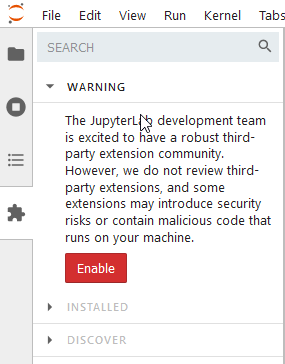
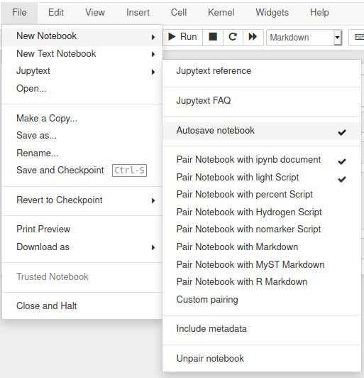
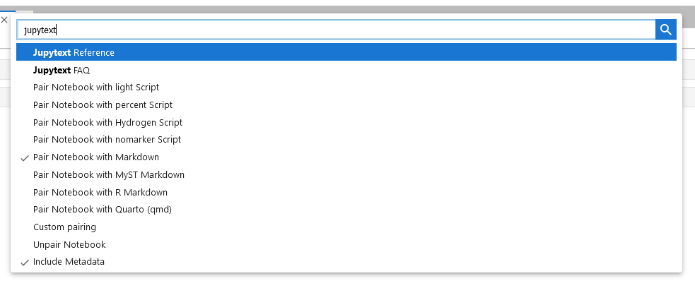

# Jupytext or another (easy) way of writing a notebook

It is clear that using Jupyter Notebooks/Labs are quite easy to develop and at the same time explain the work you are carrying out. However, you need to be under the Jupyter environment to write them. I personally find it annoying having to switch between different cell types, etc. Besides, if you want to track your progress using version control software like git, Jupyter's JSON-based `.ipynb` format is not optimal.

In this sense, it is more user (developer) friendly to directly use markdown or any specific scripting/programming language file formats (`.md`, `.py`, `.sh`, etc.). All of them play quite well with version control software.

Luckily the Jupyter community has develop an extension called [Jupytext](https://jupytext.readthedocs.io/en/latest/) which solves these issues. It enables editing Jupyter notebooks as plain text documents in your favorite ID. It supports saving notebooks as Markdown files or scripts in various languages.

Jupytext works by linking a Jupyter notebook to a kind of siamese file in another format. Upon saving, what you modify in one file is automatically synced to the other. That means that if you make changes to your script or markdown file, once in your Jupyter environment, the changes are applied to the bound Jupyter notebook.

## Installation and setup

The installation process is as simple as it will be writing your notebooks.

Install the Jupytext Python module under the host or system your are running your Jupyter Notebook/Lab. 

```bash
$ pip install jupytext --upgrade
```

In my case, as [the system I'm configuring](LinkToPost) is based on a dockerized JupyterHub setup, Jupytext is installed in the single user docker image. Therefore, the corresponding single-user Dockerfile has to be updated.

```dockerfile
RUN pip install jupytext --upgrade
```

After installation, Jupyter Lab requires to manually enable the support for third-party extensions through the Extension Manager.

> _The JupyterLab development team is excited to have a robust third-party extension community. However, we do not review third-party extensions, and some extensions may introduce security risks or contain malicious code that runs on your machine._

If you don't proceed to the Extension Manager, Jupytext would be installed but not available for usage.



Based on the Jupytext extension documentation, a new menu entry appears under `File` menu. But this is only valid if you are using Jupyter Notebook. 



In case you are using Jupyter, this menu won’t be visible, but you can still use Jupytext via the CLI command or using the Command Pallete , which can be activated through `View -> Activate Command Pallete` menu entry or with the <kbd>Ctrl</kbd>+<kbd>Shift</kbd>+<kbd>C</kbd> keyboard shortcut.



## Usage

Just open a Jupyter Notebook, modify and save it if required. 

_`test.ipynb`_
```json
{
 "cells": [
  {
   "cell_type": "markdown",
   "id": "785dfb84",
   "metadata": {},
   "source": [
    "This is just a test"
   ]
  },
  {
   "cell_type": "code",
   "execution_count": null,
   "id": "1ad9fbff",
   "metadata": {
    "lines_to_next_cell": 0
   },
   "outputs": [],
   "source": [
    "ls"
   ]
  },
  {
   "cell_type": "markdown",
   "id": "63f930e1-8b1b-482f-8f0b-5583b95be737",
   "metadata": {},
   "source": [
    "\n"
   ]
  }
 ],
 "metadata": {
  "jupytext": {
   "formats": "ipynb,md,auto:light"
  },
  "kernelspec": {
   "display_name": "Bash",
   "language": "bash",
   "name": "bash"
  },
  "language_info": {
   "codemirror_mode": "shell",
   "file_extension": ".sh",
   "mimetype": "text/x-sh",
   "name": "bash"
  }
 },
 "nbformat": 4,
 "nbformat_minor": 5
}
```

Then using the `Command Pallete` you just have to pair the notebook with any of the available document types. In our case, we use either Markdown or light script. 

_`test.md`_
````markdown
---
jupyter:
  jupytext:
    formats: ipynb,md
    text_representation:
      extension: .md
      format_name: markdown
      format_version: '1.3'
      jupytext_version: 1.14.4
  kernelspec:
    display_name: Bash
    language: bash
    name: bash
---

This is just a test

```bash
ls
```
````

The first one, as you can see in the example above, results in a Markdown document with a header section (you can [customize the options]()) and the notebook text and code. Note that the text is just included as Markdown text while the code has the tag matching the type of kernel or code of your Jupyter notebook.

_`test.sh`_
```bash
# ---
# jupyter:
#   jupytext:
#     formats: ipynb,md,sh:light
#     text_representation:
#       extension: .sh
#       format_name: light
#       format_version: '1.5'
#       jupytext_version: 1.14.4
#   kernelspec:
#     display_name: Bash
#     language: bash
#     name: bash
# ---

# This is just a test

ls
#
#
```

The second option generates an script in the language of the code used in the notebook, with the text as comments. In our case, the example is a bash script as the kernel we were using is a bash kernel. That's is pretty useful as this way we can easily port and execute the whole set of commands.

Besides this simple examples, it is possible to include additional tags to properly include all the parameters Jupyter Notebooks support. I still have to check and test, and read the [documentation](https://jupytext.readthedocs.io/en/latest/formats.html)., understand it and test.

If at any moment you don't want to mirror the notebook and the document, use the `Unpair Notebook` from the  `Command Pallete` 

## Conclusion

This Jupyter extension has made me save a lot of time and effort while writing Jupyter Notebooks for my lectures and research work. 

Hope it helps you out too.

## Acknowledgements

And, as it should be, I would like to thanks those who make it possible to find out how to set up this. Special thanks to [Nik van der Ploeg](https://nikvdp.com/post/jupytext/) and [Marc Wouts](https://github.com/mwouts/jupytext) and all contributors  behind Jupytext and [its docuemtnation](https://jupytext.readthedocs.io/en/latest/).


https://medium.com/game-of-data/12-things-to-know-about-jupyter-notebook-markdown-3f6cef811707